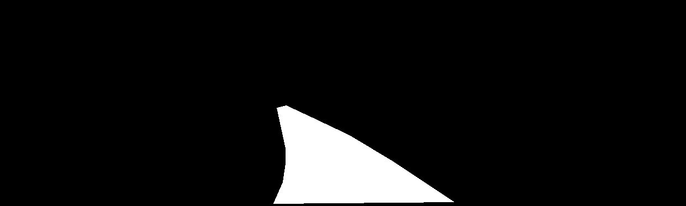
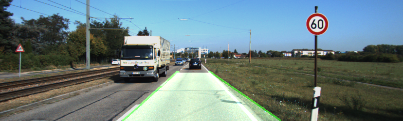
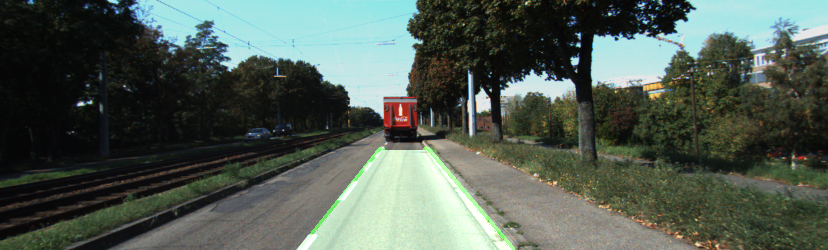
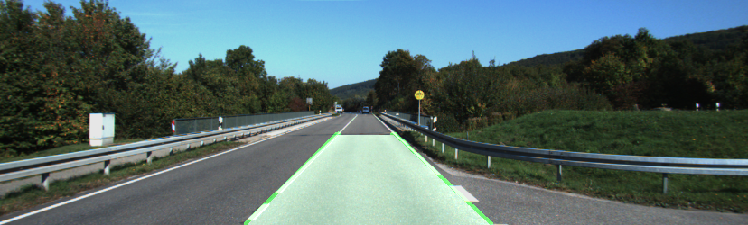
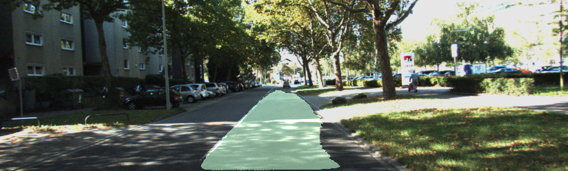

## Датасет
Датасет взят отсюда: [https://www.kaggle.com/datasets/sakshaymahna/kittiroadsegmentation](https://www.kaggle.com/datasets/sakshaymahna/kittiroadsegmentation)

Маски были преобразованы от такого вида <br />

К такому виду <br />


Изображение выглядит так <br />


## Модель
Для решения задачи была выбрана архитектура Unet <br />
```python
class Conv_block(nn.Module):
  def __init__(self, in_channels, out_channels):
    super().__init__()

    self.conv1 = nn.Conv2d(in_channels, out_channels, kernel_size=3, stride=1, padding=1, bias=False)
    self.bn1 = nn.BatchNorm2d(out_channels)
    self.conv2 = nn.Conv2d(out_channels, out_channels, kernel_size=3, stride=1, padding=1, bias=False)
    self.bn2 = nn.BatchNorm2d(out_channels)
    self.relu = nn.ReLU(inplace=True)

  def forward(self, inputs):
    x = self.conv1(inputs)
    x = self.bn1(x)
    x = self.relu(x)

    x = self.conv2(x)
    x = self.bn2(x)
    x = self.relu(x)

    return x

class Downsample(nn.Module):
  def __init__(self, in_channels, out_channels):
    super().__init__()

    self.conv = Conv_block(in_channels, out_channels)
    self.pool = nn.MaxPool2d((2, 2))

  def forward(self, inputs):
    x = self.conv(inputs)
    p = self.pool(x)

    return x, p


class Upsample(nn.Module):
  def __init__(self, in_channels, out_channels):
    super().__init__()

    self.up = nn.ConvTranspose2d(in_channels, out_channels, kernel_size=2, stride=2, padding=0)
    self.conv = Conv_block(out_channels + out_channels, out_channels)

  def forward(self, inputs, skip):
    x = self.up(inputs)
    if x.shape != skip.shape:
      x = TF.resize(x, size=skip.shape[2:])
    x = torch.cat([x, skip], axis=1)
    x = self.conv(x)

    return x


class unet(nn.Module):
  def __init__(self):
    super().__init__()


    self.down1 = Downsample(3, 64)
    self.down2 = Downsample(64, 128)
    self.down3 = Downsample(128, 256)
    self.down4 = Downsample(256, 512)


    self.transition = Conv_block(512, 1024)


    self.up1 = Upsample(1024, 512)
    self.up2 = Upsample(512, 256)
    self.up3 = Upsample(256, 128)
    self.up4 = Upsample(128, 64)

   
    self.outputs = nn.Conv2d(64, 1, kernel_size=1, padding=0)

  def forward(self, inputs):
    skip1, x = self.down1(inputs)
    skip2, x = self.down2(x)
    skip3, x = self.down3(x)
    skip4, x = self.down4(x)


    x = self.transition(x)


    x = self.up1(x, skip4)
    x = self.up2(x, skip3)
    x = self.up3(x, skip2)
    x = self.up4(x, skip1)


    outputs = self.outputs(x)

    return outputs
```

## Оценка модели
Для оценки качества использовались две метрики: точность и метрика dice <br />
На валидационной выборке показатель точности = 0.9899 <br />
На валидационной выборке показатель метрики dice = 0.9032 <br />

## Результат работы программы



